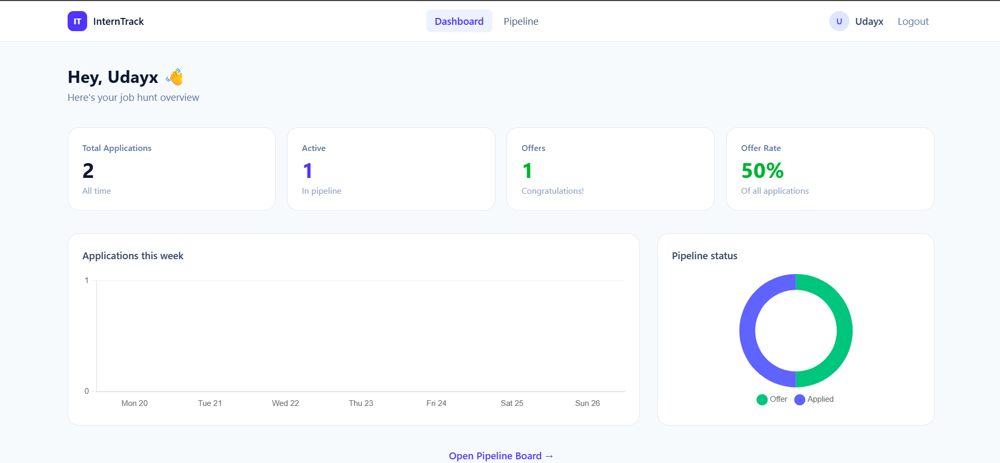

<!-- ======================== HERO ======================== -->

  

  

<!-- 

  

 -->

<!-- 

 -->

<!-- <h3 align="center">
Building software that solves real-world problems.
</h3>

  Computer Engineering Student • Full Stack Developer • AI Enthusiast

 -->

  
  
  
  
  

  

## Contribution Calendar

  

## About

I'm **Uday Shinde**, a Computer Engineering student passionate about building production-ready software.

My interests span **Full Stack Development**, **Backend Engineering**, **Artificial Intelligence**, and **Software Architecture**.

I enjoy transforming ideas into scalable applications while continuously improving through real-world projects and engineering best practices.

  

## Current Focus

- 🚀 Building **InternTrack**
- 🤖 Developing AI-powered applications
- 📚 Learning System Design
- ⚙️ Improving Backend Engineering
- 💼 Preparing for Software Engineering internships

  

## Featured Projects

<table>

<tr>

<td width="50%">

### 🚀 InternTrack

Modern job application tracking platform.

**Tech**

React • Express • MongoDB • Tailwind

**Highlights**

- Authentication
- CRUD
- Dashboard
- Responsive UI

<a href="https://intern-track-phi.vercel.app">Live Demo</a> • <a href="https://github.com/udayx-dev/InternTrack">Repository</a>

</td>

<td width="50%">

</td>

</tr>

<tr>

<td width="50%">

### 🤖 Smart Attendance

AI powered attendance system using face recognition.

**Tech**

Python • Flask • OpenCV • SQLite

**Highlights**

- Face Recognition
- Analytics
- Attendance Reports

<a href="https://github.com/udayx-dev/smart-attendance-system">Repository</a>

</td>

<td width="50%">

</td>

</tr>

</table>

  

## Tech Stack

  

## Achievements

- Cummins Nurturing Brilliance Scholarship (2026)

- Top 25 Team — UDAAN Innovation Challenge

- Student Coordinator — Developer's Club

- Industry Mentorship under Sashikant Kulkarni

  

## Engineering Philosophy

> Build software that is simple, maintainable, scalable and useful.

I believe good software is not measured by the amount of code written but by the value it creates.

  

## 📊 GitHub Analytics

  
  

  

  

  

  

  

## 📬 Connect

  <a href="https://portfolio-website-p165.vercel.app">🌐 Portfolio</a>
  &nbsp;•&nbsp;
  <a href="https://github.com/udayx-dev">💻 GitHub</a>
  &nbsp;•&nbsp;
  <a href="https://linkedin.com/in/udayxshinde">💼 LinkedIn</a>
  &nbsp;•&nbsp;
  <a href="mailto:shinde.uday538@gmail.com">📧 Email</a>

  

  
    Designed &amp; built by <strong>UDAYX</strong> 
    <em>Building software that solves real-world problems.</em> 
    © 2026 · Uday Shinde
  

